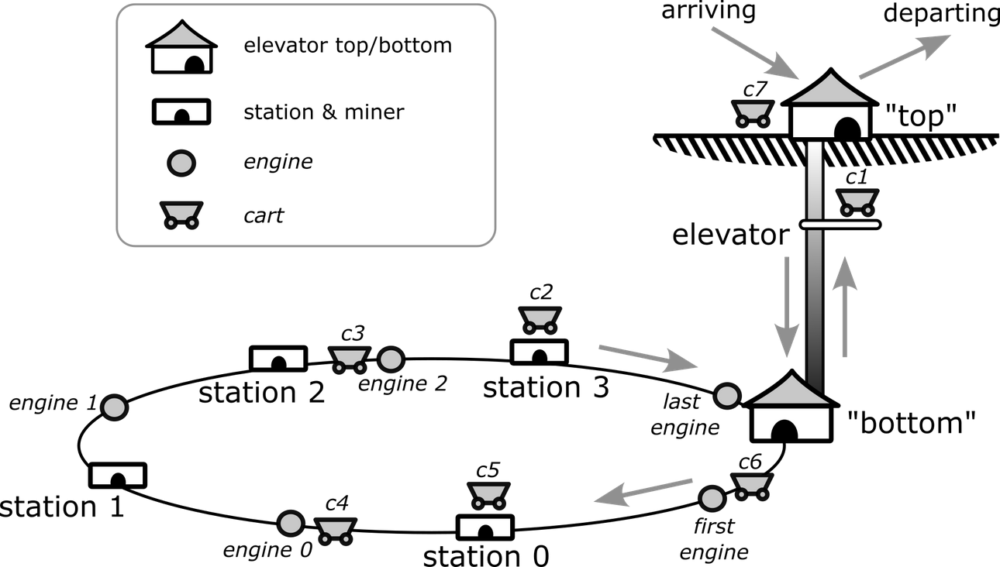

# Mines-of-Concurrency 
A demo about applying different types of concurrency control mechanisms.

## Introduction

This project aims to simulate the following system by applying the means of concurrent control:

At each **station**, there is a **miner** who mines gems. The gems are stored at the **station**, loaded onto carts, and used to transport the gems from  the mine of semaphore. Each **station** can only hold one gem at a time. If a **station** already has one gem, no more gem will be mined until the current gem is loaded onto the cart. 

The operation of the handcart is as follows: **The cart** reaches the top of the **elevator**, and is transported to the underground by the **elevator**. The **elevator** can only carry one **handcart** at a time. From the bottom of the **elevator**, the **handcart** is successively transported to the **station** by a series of **engines**. 

Each **engine** moves back and forth between a pair of **stations**, or between the bottom of a **station** and the bottom of an **elevator** (for example, the first **engine** moves back and forth between the bottom of the **elevator** and Station 0). Each **engine** can only carry one **car** at a time. 

Each station can only be occupied by one vehicle at a time. Although a vehicle can be moved to a station that has already been occupied by another vehicle, it cannot be sent to that station until the next vehicle is collected by the next locomotive.

## Structure of The Repo

├── src/   # source of the project

└── README.md

## Design concept

The design of the project is mainly divided into two parts: the determination of the basic functional processes and the design of concurrent resource control.

The first step is completing the basic function design. At this stage, I only considered the realization of functions, without considering other threads competing for the elevator(such as only considering the behavior of the elevator at the top and bottom, without considering the competition of other threads for the elevator). 

Then the task is to analyze the thread coordination problems one by one, such as dividing the elevator into two states, where the Consumer and Producer compete for the elevator's usage rights when it is at the top, and FirstEngine and LastEngine compete when it is at the bottom. Besides, I also need to design appropriate functions for the Operator to compete for the elevator's usage rights to safely change the elevator's state. After clarifying the respective relationships between the competing resources and the competitors in the system, I began to ponder over how to manage the concurrency of threads. Based on the knowledge I acquired from the Lecture, I considered two schemes: **semaphore** and **synchronized**. Considering the following points: 

1. The Station-Engine is in a circular structure underground, which may lead to deadlock. 
2.  For Elevation, three threads are competing for resources within some time, meaning that some threads may be awakened but still cannot obtain the resources and can only continue to wait, resulting in waste. 

Thus, the project uses a semaphore to control concurrency and used **tryAcquire()** of the semaphore to implement non-blocking concurrency control (CAS), aiming to avoid deadlock, reduce the blocking degree within the program, and improve the system's IO efficiency.

## Insights

As a student of software engineering, I once learned that "30% of the time in the software development process is spent on software design rather than code writing". I feel that for concurrent programming, I even need more time and greater caution. Unlike designing serial programs in the past, considering the design while writing code is no longer effective. Without a clear design of software structure and functional,  correct concurrent control analysis and selection before coding, it is impossible to produce efficient concurrent programs.
Another finding is that when a certain part of the system gets congested, the congestion seems to spread rapidly throughout the entire system. Therefore, each part of the system needs to be carefully designed.
